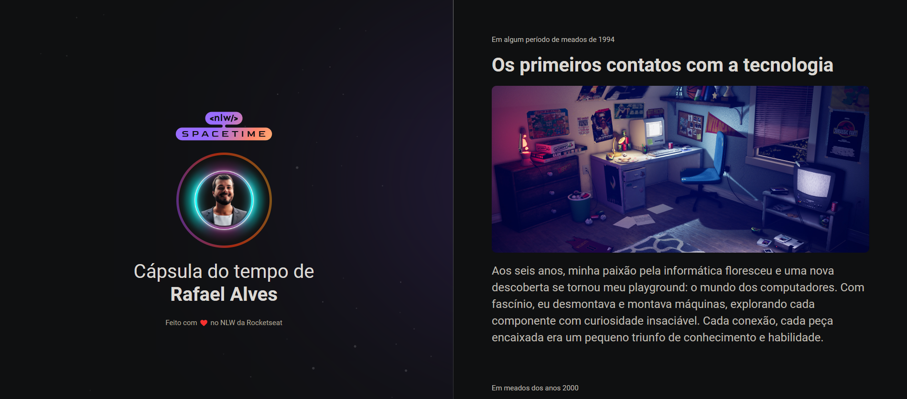

<h1 align="center">NLW Spacetime</h1>

  <a href="#-tecnologias">Tecnologias</a>&nbsp;&nbsp;&nbsp;

    Esse projeto foi desenvolvido na semana do evento NLW Spacetime como comemoração dos 6 anos da Rocketseat.

<h2 align="center">💻 Projeto finalizado</h2>

    

🚀 [Acesse por esse link o projeto online](https://rafagnx.github.io/nlw-spacetime/)

### 👨‍💻 Tecnologias

Esse projeto foi desenvolvido com as seguintes tecnologias:

- HTML
- CSS
- Figma

## 🔖 Layout

Você pode visualizar o layout do projeto através [DESSE LINK](<https://www.figma.com/file/RePWGzbzb9b0jTzcN1Ts91/C%C3%A1psula-do-tempo-%E2%80%A2-Trilha-Explorer-(Community)>). É necessário ter conta no [Figma](https://figma.com) para acessá-lo.

---

Feito com ♥ by RafaGnx :wave: 

